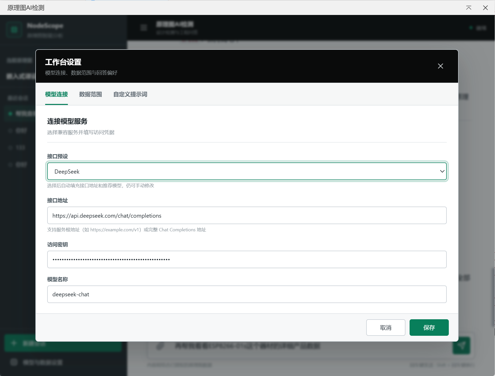
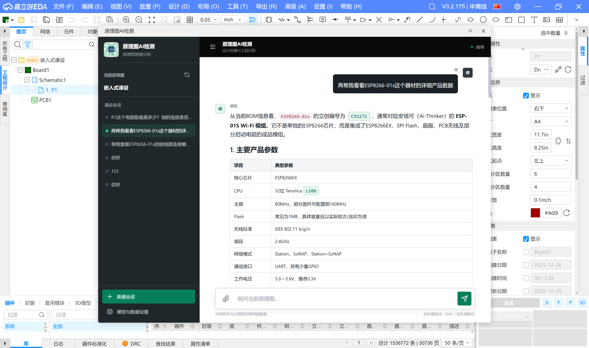
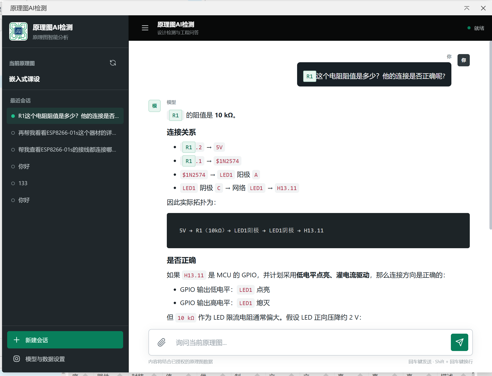

# 原理图AI检测

面向嘉立创 EDA 专业版的原理图 AI 对话与分析扩展。扩展会读取当前工程的原理图结构，
将器件、引脚和网络关系整理为结构化上下文，再交给用户自行配置的 AI 模型进行分析。

## 主要功能

- 读取多页原理图中的器件、引脚、网络与连接关系
- 通过自然语言询问电路功能、连接关系和设计风险
- 支持流式回答及兼容模型的思考过程显示
- 在回答中点击器件位号或网络名称，返回原理图定位
- 支持对话历史、附件、停止生成、重新生成与手动刷新原理图
- 可选择发送给模型的字段，减少无关数据和 Token 消耗
- 支持追加自定义提示词，指定检查重点或回答格式

## 运行环境

- 嘉立创 EDA 专业版 3.0 或更高版本
- 可访问的 OpenAI Chat Completions 等兼容模型服务
- 由模型服务商提供的 API Key

本扩展不附带模型额度，调用费用、速率限制及数据处理规则由所选模型服务商决定。

## 安装方法

1. 下载扩展文件 `ai-schematic-detection_v0.1.0.eext`。
2. 在嘉立创 EDA 专业版中打开扩展管理器。
3. 选择导入本地扩展并安装 `.eext` 文件。
4. 安装完成后打开一个原理图工程。
5. 从顶部菜单选择 `AI检测 -> 原理图AI检测...`。

## 模型配置

首次使用时，点击界面中的设置按钮并填写以下信息：

- **API 预设**：可选择常见模型服务商，也可以选择“自定义”
- **API 地址**：支持服务根地址，例如 `https://example.com/v1`；也支持完整的
  Chat Completions 地址，例如 `https://example.com/v1/chat/completions`
- **API Key**：模型服务商提供的访问密钥
- **模型名称**：服务商实际开放的模型 ID

预设只负责填入推荐地址和模型名称，最终可用性以对应服务商当前文档为准。
若使用自建服务或代理服务，请确认其接口与 OpenAI Chat Completions 格式兼容。

配置完成后点击“保存”。模型地址、模型名称、数据范围、追加提示词和 API Key
会保存在嘉立创 EDA 的扩展存储中。

## 使用方法

1. 打开需要分析的原理图。
2. 启动“原理图AI检测”，等待原理图数据采集完成。
3. 在输入框中直接提问，例如：
   - `概括这个电路的主要功能和信号流向。`
   - `检查电源网络是否存在明显风险，并说明依据。`
   - `U3 的外围器件分别有什么作用？`
   - `列出未连接或连接关系可疑的引脚。`
4. 修改原理图后，点击刷新按钮重新采集数据，再继续对话。

AI 的输出可能存在遗漏或错误，只适合作为设计辅助。生产、安规和高可靠性设计仍需由工程师
结合器件数据手册、ERC/DRC 结果和实测数据复核。

## 例程

1.打开AI助手界面后选择模型与数据选择（如下图），选择自己对应的供应商（也可以选择自定义），只需要复制自己的API即可绑定成功

2.打开任意一个原理图，即可与AI进行对话（原理图越复杂时间越长）

3.点击R1可以跳转到对应的元件，并且读取的阻值都是正确的

4.主要功能包括
   - `检查整个电路主要功能和是否出现风险`
   - `搜索指定的芯片功能和作用`
   - `列出芯片相连的引脚有哪里，并自动分析有无风险`
   - `点击对话框的器件文字可以跳转到对应位置`

## 隐私与安全

- 只有在用户发起 AI 请求时，所选原理图数据、问题和附件才会发送到配置的模型服务地址。
- API Key 与扩展配置保存在嘉立创 EDA 的扩展存储中。
- 使用第三方或自建模型服务前，请确认其隐私政策、数据保留规则与网络安全性。
- 不建议向不受信任的服务发送包含商业机密、客户资料或未公开产品信息的原理图。

## 版本记录

详见 [CHANGELOG.md](CHANGELOG.md)。

## 开源许可

本扩展采用 Apache License 2.0 许可证发布。完整条款及第三方声明见扩展包内的
`LICENSE` 和 `NOTICE` 文件。
